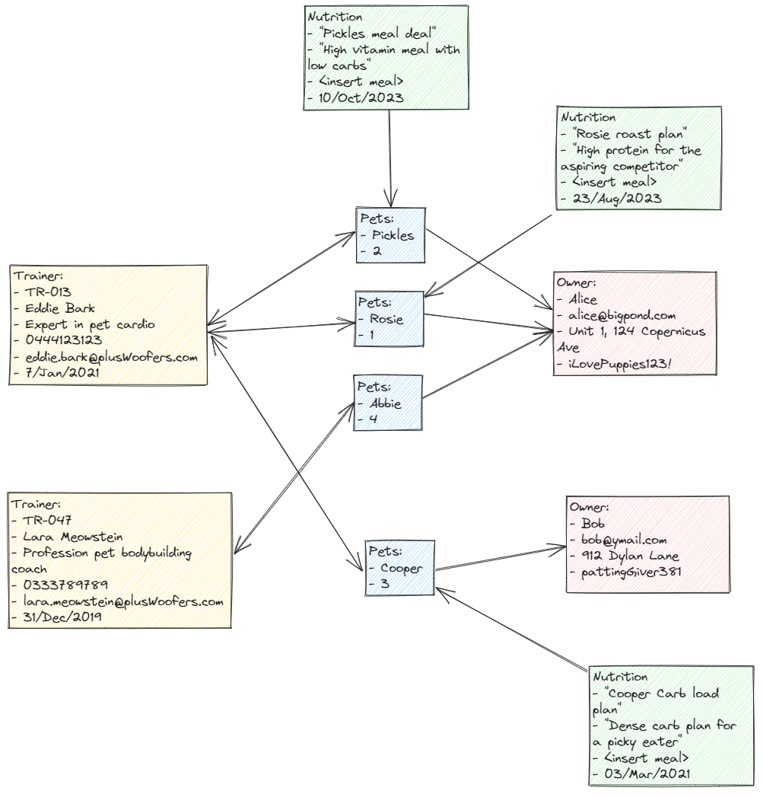

# PET FITNESS - A FastAPI Reference Backend

This is a tutorial backend for those trying to understand and learn FastAPI as well as a reference project
It contains the basics to start creating a full fledge FastAPI backend as well as understanding the fundamentals of Pytest!

Pre-requisite:
- Python knowledge

## Premise

*Welcome to Pet Fitness where you can train your pets by our very own, and very talented Trainers!*
*Our world class trainers will design a unique nutrition plan for every single one of you pets!*
*All you have to do is register you, your pets, and we will have one of our very own trainers evaluate your fuzzy little (or big) friends!*

> "Training a dog is like teaching a 2-year-old to clean their room. Good luck with that." ~ Anonymous

## Project Structure

Each Model has its own set of CRUD features
- Pets data be created, viewed, updated and deleted
- Owner data be created, viewed, updated and deleted
- Trainer data be created, viewed, updated and deleted
- Nutrition Plan created, viewed, updated and deleted

Contains learning how to apply SQLAlchemy to different DB relationships:
- Multiple Pets can belong to one Owner (One-to-Many relationship)
- Multiple pets can be trained by multiple trainer (Many-to-Many relationship via Association Object)
- Each pet can be on one unique nutrition plan at a time (One-to-One relationship)

There are also dependencies in the order of which pets are assigned.
- A pet can be assigned an owner
- A pet can be assigned an trainer, only if they are assigned to an owner
- A pet can be assigned a nutrition plan, only if they are assigned to a trainer

## Learning order

Depending on what you want to learn, certain files can be ignored

### Basics of RestAPI Developement
1. database.py
2. models.py
3. schemas.py
4. cruds.py
5. main.py

### Basics of PyTest writing
1. conftest.py
2. wrappers.py
3. *_test.py

## Setting Up

If you have not installed fastapi:
```
pip3 install "fastapi[all]"
```

If you have not installed SQLITE3 before:
```
pip3 install sqlite3
```

If you have not installed SQLAlchemy before:
```
pip3 install SQLAlchemy
```

If you want to auto-install all of the dependencies:
```
pip3 install -r requirements.txt
```

## Start up

To start the server, while in the root folder for this project `/pets_fastapi`, run:
```
python3 -m uvicorn main:app --reload
```
or if you want to specify a port
```
uvicorn main:app --reload --port 8001
```

Visit [http://127.0.0.1:8000/docs](http://127.0.0.1:8000/docs) to view Swagger Docs

## Testing

There are testing functions that have been provided.
1. **Populate**: A simple function that populates a database when the webserver is running. Used to populate the database based on a following structure
2. **Unit**: A set of unit tests to test each endpoint in the project. Built using the Pytest library.

### Populate
To run the data populator, first start the webserver (see Start Up Section) and run following commands in the separate terminal in the root folder for this project `/pets_fastapi`:

```
python3 tests/unit/populate.py
```

It will generate a data set that have the following relationship seen in the diagram below.



### Unit
To run the unit test, run the following commands in the root folder for this project `/pets_fastapi`:

To run every test
```
python3 -m pytest tests/unit/*_test.py
```

To run specific tests
```
python3 -m pytest tests/unit/<INSERT_TEST_NAME>_test.py
```

